<h1 align="center"> Empty the Array </h1>
<h2> Welcome </h2>

<h4> 
  This is the Python-based command-line game: "Empty the Array".<br>This game is a variant of Shut the box (also called canoga, batten down the hatches, or trick-track) dice game.

  [More information on the dice game here](https://en.wikipedia.org/wiki/Shut_the_box).

  The user and the program-generated opponent have each an array with numbers from 1 to 9. The game will go for 9 rounds (one round for each number) or when one of the players has an empty array.<br>The score will be calculated by the sum of each player's array.<br>The player with the lowest score wins.
  
  Only up to 3 numbers can be removed in one round and all numbers can only be used once.
  If you use 2 or 3 numbers, with one of the numbers already being removed from the array, the input is invalid as only numbers can be removed from the array, that is still in the array.
<h4>

<h2 align="center">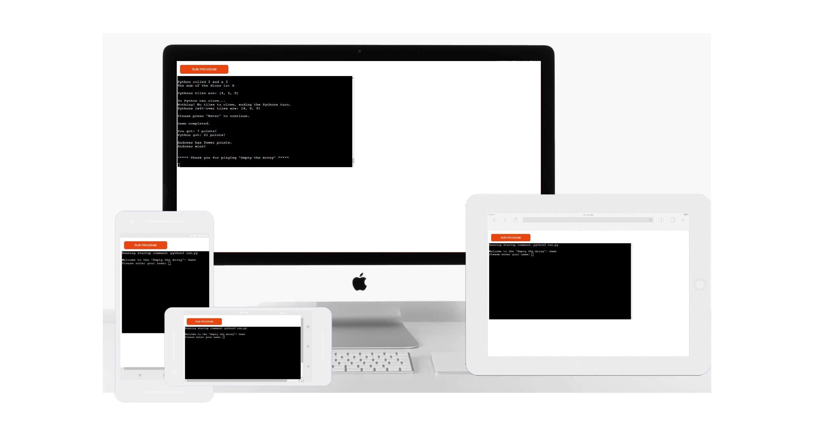</h2>

[View the live project here](https://empty-the-array.herokuapp.com/)

<hr>

<h2> Table of content </h2>

- ### [User Experience (UX)](#user-experience-ux-1)
  - [Customer Focus](#customer-focus)
  - [Design](#design)
  - [Flowchard](#flowchard)
- ### [Features](#features-1)
  - [Existing Features](#existing-features)
  - [Features Left to Implement](#features-left-to-implement)
- ### [Technologies Used](#technologies-used-1)
  - [Languages Used](#languages-used)
  - [Frameworks, Libraries & Programs Used](#frameworks-libraries--programs-used)
- ### [Testing](#testing-1)
  - [Testing the User Experience (UX)](#user-experience-ux)
  - [Further Testing](#further-testing)
  - [Known Bugs](#known-bugs)
  - [Fixed Bugs](#fixed-bugs)
- ### [Deployment](#deployment-1)
  - [Heroku](#heroku)
- ### [Credits](#credits-1)
  - [Code](#code)
  - [Content](#content)
  - [Media](#media)
  - [Acknowledgements](#acknowledgements)

<hr>

## User Experience (UX) 

- ### Customer Focus
  1. The player needs to be able to enter a name to have a more personalized experience.
  2. The player needs to be able to easily read through the rules of the game.
  3. The player needs to be shown clear messages about the game's progress and errors.
  4. The player needs to be able to get a summary of the game and outcome.

- ### Design
    
  - #### Readability
    As a command-line game, the only output option is text.<br>
    Hence the text must be displayed in a readable manner, taking care to prevent information overload and odd spacings.

- ### Flowchard
    - Program Flowchard
    <h2 align="center"></h2>

<hr>

## Features
- ### Existing Features
  - #### Welcome Message
    A friendly message and some ASCII art to state the name of the game and give a preview that it must be a game about tiles numbered from 1 to 9 and dice rolls.
    <h3>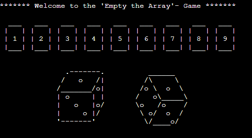</h3>

  - #### Enter Name
    The input request for the player's name. This input value will be later on used in the program to highlight user actions or output related to the user.<br>This input request has no validation, as the user is free to choose whatever name the user wants to use.
    <h3></h3>

  - #### Start-Up
    The start-up has an input request where the player can select to read about the game rules and understand how to play the game or to start playing the game right away but typing "game" or "rules" and confirming with 'Enter'.
    <h3>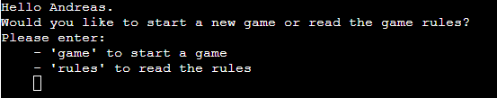</h3>
    
  - #### Start-Up-Validation
    To make sure that the correct input was made, the input value will be validated.<br>Only  "game" or "rules" are valid inputs, any other input will prompt an error message, requesting the correct input value.
    <h3>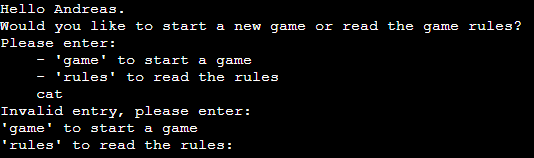</h3>
    
  - #### Game Rules
    New users, that are unfamiliar with the game, can read up on how this game is played and how the winner is calculated.<br>
    Unlike most games, the player with the least amount of points wins this game.<br>
    Additionally only the added sum of the dices is important and any combination of up to three different numbers,<br>that would reproduce this sum, is valid if all of these numbers can be removed from the array.<br>
    For example, if the total number is "8" the player may choose any of the following sets of numbers:
    - 8
    - 7, 1
    - 6, 2
    - 5, 3
    - 5, 2, 1
    - 4, 3, 1
    
    <br>
    <h3>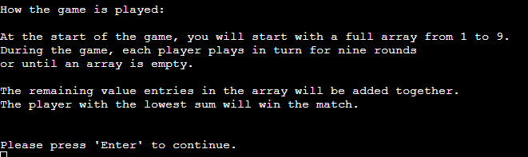</h3>

  - #### Press 'Enter' to continue
    The input request "Press 'Enter' to continue" was implemented throughout the program to prevent too much text from being displayed at once.<br>This way an informational overload can be avoided at the cost of the player needing to press 'Enter' now and then.<br>This input request is not validated and will accept other input, but ignores everything save for the 'Enter' input.
    <h3>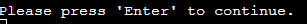</h3>

  - #### Dice
    The dice roll is simulated with the help of the random module, randomly creating a number between 1 and 6.<br>This is called up twice and then added together to provide the number for the respective player.
    <h3>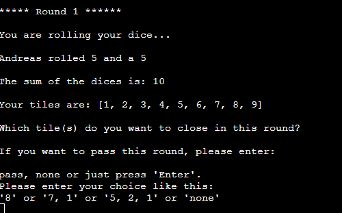</h3>

  - #### Input validation
    To make sure that the user is providing valid input, several input validations have to be made and all must be passed to progress in the game:
    1. **Does the user want to pass this around?**<br>If the user decides to risk it and wait for better numbers, passing a turn is an option.<br>In this case input of 'none' is required and the user will have the next player roll the dice.<br>Additonally to 'none':<br> 'None', 'pass', 'Pass', and pressing Enter with entering no value will be valid entries to pass the turn.<br>All other input will be validated in the next step.
        <h3>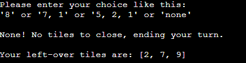</h3>

    1. **Is the input a or multiple number(s)?**<br>As the first validation already filtered out all valid inputs, that are not a number, only numbers are allowed from this point onward.<br>If the input is neither a number nor one of the approved non-number values, the player will get an error message explaining that number is needed and is requested to make a different input.
        <h3>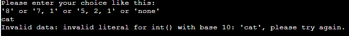</h3>
    
    1. **Does the number(s) add up to be equal to the sum of both dices?**<br> To make sure that the correct numbers are provided, the first test is to check if it matches the sum of both dices.<br>If there is a difference, an error message will appear stating that the numbers provided do not match the combined value of the two dices.<br>
    The user is then requested to make a different input.
        <h3>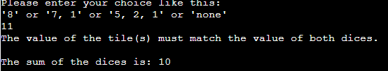</h3>

    1. **Are the numbers different?**<br>As stated in the rules, if more than one number is used, they must be different.<br>While five + five = ten, five can only be removed from the array once.<br> Therefore this would be an invalid input.<br>For example one + nine, would be fine at this stage, as they are different numbers.<br>If one of the numbers in the input is the same as another, an appropriate error message will be displayed and a different input is requested.
        <h3>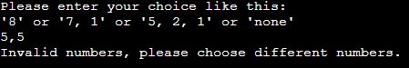</h3>

    1. **How many numbers are provided?**<br>As per the rules of the game only up to 3 numbers can be used per turn, it is now checked how many numbers were provided by the user.<br>If the more than 3 numbers are verified, an error message state how many numbers were proved and request a new input of only up to 3 numbers.
        <h3>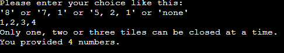</h3>

    1. **Is the number still in the array?**<br>Since only numbers that are still in the array can be closed, the last validation is, after going through all other steps and making sure that normally this input should be valid and remove the number from the array, to check if the number is still in the array.<br>This is especially important by multiple numbers since all numbers have to be able to be used.<br>If the numbers 1,2,5 are entered however the player's array is down to [1, 3, 4, 5, 7], only 1 and 5 could be used.<br>Hence a new input request would be made after displaying which number was invalid.
        <h3>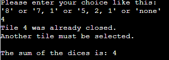</h3>

    Only after passing all validations successfully, will the program continue, otherwise it will request a new valid entry from the player and will go through all steps again.

  - #### Display on Progress and vital information
    To make sure the player gets the information that the input was correctly processed, not only will a confirmation on the numbers removed appear as an output on the screen, but also an overview of the current state of his tiles will be shown.
    <h3>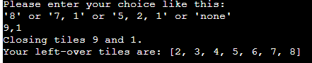</h3>

  - #### Computer opponent
    This game comes with an automated opponent that will be subject to the same random dice roll function as the player and will select numbers to close according to the same ruleset.<br>The only thing 'Python' will not do is to pass a turn if 'Python' could remove a number.<br>Stratgie is not 'Python' strongest ability in this instance.
    <h3>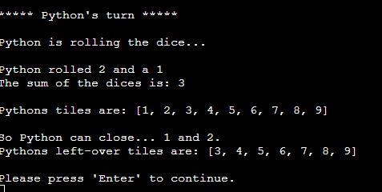</h3>

  - #### Score claculation
    After the 9th round or if one of the players managed to clear out the array, all values in the array will be added together.<br>
    The player, that is scoring the least amount of points and therefore the one that was able to not only remove the most numbers but also most of the biggest numbers.<br>
    Removing 1,3,5 is great, however removing 9 might be better, as you might have the chance to close more tiles if you still have some rounds left to play.
    <h3>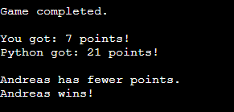</h3>

  - #### Game End Message
    The game concludes with a 'Thank you' message to the user for playing the game and an ASCII art with 'closed tiles' signaling that the game is completed.
    <h3>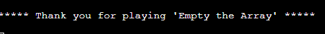</h3>

- ### Features Left to Implement
  - #### Start a new match
    The program originally was made with the intent to allow the player to select a new match after completing the game the first time.<br>This is why the name input is in a separate function and called before the main / main_game function.<br>The idea was that the player could call up the main_game function without needing to enter a name again and keep the score for the previous round.<br>
    Finishing up this program to the current stage, exposed two issues:
    1. Nine Rounds are quite long to play.
    2. Attempts to implement this feature had the problem, that the arrays could not be overwritten with a full set of numbers.<br>
    
    It was therefore decided to leave this feature out of the program and implement it in a later version.
    
  - #### Exporting name and score
    Another feature for a later version is to connect this program with API or database and have the results of the game exported.

<hr>

## Technologies Used
- ### Languages Used
    - [Python](https://en.wikipedia.org/wiki/Python_(programming_language))

- ### Frameworks, Libraries & Programs Used
    1. [Git](https://git-scm.com/) - Git was used for version control by utilizing the [Gitpod](https://gitpod.io/) terminal to commit to Git and Push to GitHub.
    1. [GitHub:](https://github.com/) - GitHub was used to store the code of the project after being pushed from Git.
    1. [Heroku:](https://dashboard.heroku.com/apps) - Heroku was used to deploy the project.
    1. [Lucidchart:](https://lucid.app) - Lucidchart was used to create the flowchart of the program
    1. [tinypng:](https://tinypng.com/) - Tinypng was used to reduce the file size of pictures.
    1. [Paint 3D:](https://www.microsoft.com/de-de/p/paint-3d/9nblggh5fv99?activetab=pivot:overviewtab) - Paint 3D was used to work on the pictures.
    1. [Responsinator:](http://www.responsinator.com/) - Responsinator was used to review the website on different resolutions.
    1. [Grammarly:](https://app.grammarly.com/) - Grammarly was used for spell checking.
    1. [Notepad++:](https://notepad-plus-plus.org/) - Notepad++ for keeping notes for the project.

<hr>

## Testing

The PEP8 online was used to validate the code for PEP8 requirements
    <h3>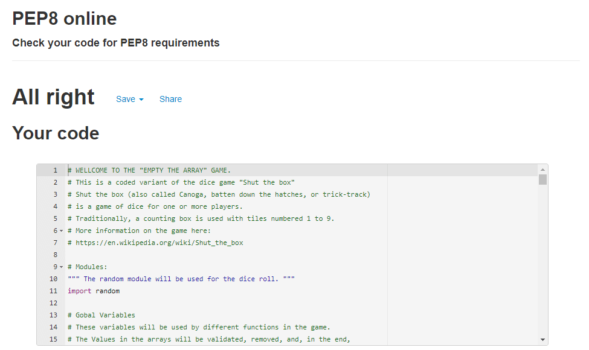</h3>

### Testing the User Experience (UX)
- Friends and family members were asked to review the site:
  - The instructions are clear.
  - The game displays the correct message.
  - The input validation works as intended.
  - The score is added correctly.

### Further Testing
-  The Website was tested on Brave, Google Chrome, Internet Explorer, Microsoft Edge, and Safari browsers.
-  The Website was viewed on Responsinator to emulate: iPhone eXpensive, Android (Pixel 2), iPhone 6-8, iPhone 6-8 Plump, iPad
-  A large amount of testing was done to ensure that all pages were linking correctly.

### Known Bugs
- The text is hard to read on mobile devices and often does not fit in the portrait mode.
- The panorama mode on mobile devices will half the screen blocked by the "keyboard".

### Fixed Bugs
- The computer "try and error" value removal process:<br>The program does indeed go through the process of trying an action, and upon receiving an error, continuing with the next action until one of the actions works. The last action available is to print out that no action could be taken.<br>At first the program only worked with clear setup values for each number from 1 to 12. Changes were made to consolidate and shorten the program for this process, which made the computer unable to close multiple values at once.
By creating an extra variable for this process that could be trusted to deliver the needed values and splitting up the "try and error" process into three parts.<br>While it is heavily nested, it does work as intended.
- Function naming:<br> Some of the functions have been renamed to state more clearly what they are supposed to accomplish.<br>However there were some shortening necessary:
  - combinations -> combi
  - validation -> val
  - number -> num<br><br>
- The player input validation:<br>
At first, the player input validation had been programmed similar to the "start-up" function for the "Game Rules / Start Game"-Option early in the game.<br>While the validations were displaying the correct error messages, input correction would lead to the program to fail.<br>Somehow the first option picked was still in place and not overwritten by restarting the input process.<br><br>The first attempt on fixing this problem was done by consolidating all validations in the first validation function, instead of having a function call up other function in a string of pearls like fashion.<br>The process of the computer going through "trial and error" for emptying the array is programmed in that string of pearls-like way, this part of the program is working as intended. Which added more to the confusion, as some functions seem to work just fine this way, while others did not.<br><br>The idea behind the consolidating was that the bug was caused by having to jump back to a previous function, hence a consolidating in one function would solve that problem.<br><br>
Alas it did not and the complete player input validation was rewritten.<br><br>
In the project [Love Sandwiches](https://github.com/AndrosDe/Love-Sandwiches) a validation was implemented that did exactly what was needed for this project, so I reviewed that part of the program.<br><br>
By carefully programming this while-loop validation, which would be running as long as the conditions inside were "True", the functions were strongly atomized.<br> As a lot of the validations are dependent on each other a nesting of if statements was needed.<br> To make sure that none of the validations would change the actual input and are just returning "True" or "False", the program has now some similar-looking functions.
Some of these functions are for validating, while the others to the intended changes to the input: 
  - creating an array
  - changing the values from strings to integers
  - removing the correct value from the primary array)

  <br>These changes did help solve the previous problem and also improved the player input request, as the player is no longer required to state separately how many values of the array are to be removed and then to specify the values.<br>Instead the player is now asked to input the values right away and will start validating the input.

<hr>

## Deployment

### Heroku (before 16.04.2022)

The project was deployed to [Heroku](https://www.heroku.com) using the below procedure:
  
1. **Log in to Heroku** or create an account if required.
1. **click** the button labeled **New** from the dashboard in the top right corner, just below the header.
1. From the drop-down menu **select "Create new app"**.
1. **Enter a unique app name**. I used the same name as the GitHub repository (empty-the-array) for this project.
1. Once the web portal shows the green tick to confirm the name is original **select the relevant region.** In my case, I chose Europe as I am in Germany.
1.  When you are happy with your choice of name and that the correct region is selected, **click** on the **"Create app" button**.
1. This will bring you to the project "Deploy" tab. From here, navigate to the **settings tab** and scroll down to the **"Config Vars" section**. 
1. **Click** the button labelled **"Reveal Config Vars"** and **enter** the **"key" as port**, the **"value" as 8000** and **click** the **"add"** button.
1. Scroll down to the **buildpacks section of the settings page** and click the button labeled **" add buildpack," select "Python," and click "Save Changes"**.
1. **Repeat step 9 but** this time **add "node.js" instead of python**. 
   * ***IMPORTANT*** The buildpacks must be in the correct order. If node.js is listed first under this section, you can click on python and drag it upwards to change it to the first buildpack in the list.
1. Scroll back to the top of the settings page, and **navigate to the "Deploy" tab.**
1. From the deploy tab **select Github as the deployment method**.
1. **Confirm** you want to **connect to GitHub**.
1. **Search** for the **repository name** and **click** the **connect** button next to the intended repository.
1. From the bottom of the deploy page **select your preferred deployment type** by following one of the below steps:  
   * Clicking either "Enable Automatic Deploys" for automatic deployment when you push updates to Github.  
   * Select the correct branch for deployment from the drop-down menu and click the "Deploy Branch" button for manual deployment.

### Heroku (after 16.04.2022)
1. **Log in to Heroku** or create an account if required.
2. Open a new tab and **Log in to GitHub**.
3. Locate the **[GitHub Repository](https://github.com/AndrosDe/Empty_the_Array)**
4. At the top of the Repository (not top of page), locate the green **"Gitpod"** button.
5. Open **Gitpod** in a new tab and enter the appropriate Gitpod-Workspace.
6. In Gitpod open a new **Terminal**.
7. Run the **Command**:
  ```
   heroku login -i 
  ```
8. Enter the Heroku login information when prompted.
9. After being logged in run the next **Command**:
  ```
   heroku create empty-the-array
  ```
10. Change back to the tap with **Heroku** and refresh.
11. Verify that the new app is in your **Heroku** account.
12. Open the app in **Heroku** and navigate to the **settings tab**.
13. Scroll down to the **"Config Vars" section** and **Click** the button labeled **"Reveal Config Vars"**.
14. **Enter** the **"key" as port**, the **"value" as 8000** and **click** the **"add"** button.
15. Scroll down to the **buildpacks section of the settings page** and click the button labeled **" add buildpack," select "Python," and click "Save Changes"**.
16. **Repeat step 15 but** this time **add "node.js" instead of python**. 
   * ***IMPORTANT*** The buildpacks must be in the correct order. If node.js is listed first under this section, you can click on python and drag it upwards to change it to the first buildpack in the list.
17. Go back to the **Gitpod** tab.
18. Now to deploy the new version of the app, enter the following **Command** into the **Terminal**:
  ```
   git push heroku main
  ```
<hr>

## Credits

### Code
- The repository was created with the [Code Institute Python Essentials Template](https://github.com/Code-Institute-Org/python-essentials-template).
- The creation of the README was influenced by [Code Institute SampleREADME](https://github.com/Code-Institute-Solutions/SampleREADME) and [Jousting](https://github.com/AndrosDe/Jousting)
- The code for the while-loop validation was influenced by [Love Sandwiches](https://github.com/AndrosDe/Love-Sandwiches).
- 98% of the deployment to Heroku was copied from the README of [battleships](https://github.com/dnlbowers/battleships/blob/main/README.md).
- [w3schools.com](https://www.w3schools.com/python/python_arrays.asp) helped me review sample codes with an array, set, tuples, and operators.

### Content
-  All English content was written by the developer.

### Media
- The pictures are in the public domain, free of use, and have been modified a lot by the developer to make them useful for this project.

### Acknowledgements
-  My Mentor Mr. Dario Carrasquel for continuous helpful feedback.
-  The [Love Sandwiches](https://github.com/AndrosDe/Love-Sandwiches) for inspiring me and allowing me to look code up.
-  dnlbowers for the "Deployment to Heroku" README - Part of [battleships](https://github.com/dnlbowers/battleships/blob/main/README.md).
- Joan G. Stark for the ASCII [Dice Art](https://www.asciiart.eu/miscellaneous/dice).