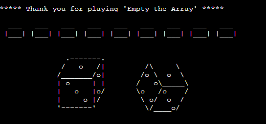

<h1 align="center"> Empty the Array </h1>
<h2> Welcome </h2>

<h3> 
  This is the Python-based command-line game: "Empty the Array". This game is a variant of Shut the box (also called canoga, batten down the hatches or trick-track) dice game.

  [More information on the dice game here](https://en.wikipedia.org/wiki/Shut_the_box).

  The user and the programm generated opponent have each an array with numbers from 1 - 9. The game will go for 9 rounds (one round for each number) or when one of the players has an empty array. The score will be calculated by the sum of each players array. The player with the lowest score wins.
  
  Only up to 3 numbers can be removed in one round and all number can only be used once.
  If you use 2 or 3 numbers, with one of the numbers already being removed from the arry, the input is invalid as only number can beremoved from the array, that are still in it.
<h3>

<h2 align="center"></h2>

[View the live project here](https://empty-the-array.herokuapp.com/)

<h2> Table of content </h2>

- ### [User Experience (UX)](#user-experience-ux-1)
  - [Customer Focus](#customer-focus)
  - [Design](#design)
  - [Flowchard](#flowchard)
- ### [Features](#features-1)
  - [Existing Features](#existing-features)
  - [Features Left to Implement](#features-left-to-implement)
- ### [Technologies Used](#technologies-used-1)
  - [Languages Used](#languages-used)
  - [Frameworks, Libraries & Programs Used](#frameworks-libraries--programs-used)
- ### [Testing](#testing-1)
  - [Testing the User Experience (UX)](#user-experience-ux)
  - [Further Testing](#further-testing)
  - [Known Bugs](#known-bugs)
  - [Fixed Bugs](#fixed-bugs)
- ### [Deployment](#deployment-1)
  - [Heroku](#heroku)
- ### [Credits](#credits-1)
  - [Code](#code)
  - [Content](#content)
  - [Media](#media)
  - [Acknowledgements](#acknowledgements)

## User Experience (UX) 

- ### Customer Focus
  1. The player needs to be able to enter a name to have a more personolized experiance.
  2. The player needs to be able to easily read trough the rules of the game.
  3. The player needs to be shown a clear messages about the game progress and errors.
  4. The player needs to be able to get a summary of game and outcome.

- ### Design
    
  - #### Readability
    As a command-line game the only output option is text. 
    Hence the text must be diplayed in a readable manner, with taking care to prevent informational overload and odd spacings.

- ### Flowchard
    - Program Flowchard
    <h2 align="center"></h2>

## Features
- ### Existing Features
  - #### Welcome Message

    <h3></h3>

  - #### Enter Name

    <h3></h3>

  - #### Start-Up

    <h3></h3>
    
  - #### Start-Up

    <h3></h3>
    
  - #### Game Rules

    <h3></h3>

  - #### Press 'Enter' to continue

    <h3></h3>

  - #### Dice

    <h3></h3>

  - #### Input validation

    <h3></h3>

    <h3></h3>

    <h3></h3>

    <h3></h3>

    <h3></h3>

    <h3></h3>

  - #### Display on Progress and vital information

    <h3></h3>

  - #### Computer opponent

    <h3></h3>

  - #### Score claculation

    <h3></h3>

  - #### Game End Message

    <h3></h3>

- ### Features Left to Implement
  - #### Start a new match
    The program orginally was made with the intent to allow the player to select a new match after completeing the game the first time. This is why the name input is in a sperate function and called before the main / main_game function. The idea was that the player could call up the main_game function without needing to enter a name again and keepting the score for the previous round. 
    Finishing up this programm to the current stage, exposed two issues:
    1. Nine Rounds are quite long to play.
    2. Attempts to implement this feature had the problem, that the arrays could not be overwritten with a full set of numbers. 
    
    It was therefore decided to leave this feature out of the programm and implement it in a later version.
    
  - #### Exporting name and score
    Another feature for a later version is to connect this program with API or database and have the results of the game exported.

## Technologies Used
- ### Languages Used
    - [Python](https://en.wikipedia.org/wiki/Python_(programming_language))

- ### Frameworks, Libraries & Programs Used
    1. [Git](https://git-scm.com/) - Git was used for version control by utilizing the [Gitpod](https://gitpod.io/) terminal to commit to Git and Push to GitHub.
    1. [GitHub:](https://github.com/) - GitHub was used to store the code of the project after being pushed from Git.
    1. [Heroku:](https://dashboard.heroku.com/apps) - Heroku was used to deploy the project.
    1. [Lucidchart:](https://lucid.app) - Lucidchart was used to create the flowchart of the program
    1. [tinypng:](https://tinypng.com/) - Tinypng was used to reduce the file size of pictures.
    1. [Paint 3D:](https://www.microsoft.com/de-de/p/paint-3d/9nblggh5fv99?activetab=pivot:overviewtab) - Paint 3D was used to work on the pictures.
    1. [Responsinator:](http://www.responsinator.com/) - Responsinator was used to review the website on different resolutions.
    1. [Grammarly:](https://app.grammarly.com/) - Grammarly was used for spell checking.
    1. [Notepad++:](https://notepad-plus-plus.org/) - Notepad++ for keeping notes for the project.

## Testing

The PEP8 online was used to validate the code for PEP8 requirements
    <h3></h3>

### Testing the User Experience (UX)
- Friends and family members were asked to review the site:
  - The instructions are clear.
  - The game displays the correct message.
  - The input validation works as intended.
  - The score is added correctly.

### Further Testing
-  The Website was tested on Brave, Google Chrome, Internet Explorer, Microsoft Edge, and Safari browsers.
-  The Website was viewed on Responsinator to emulate: iPhone eXpensive, Android (Pixel 2), iPhone 6-8, iPhone 6-8 Plump, iPad
-  A large amount of testing was done to ensure that all pages were linking correctly.

### Known Bugs
- The text is hard to read on mobile devices and often does not fit in the portrait mode
- The panorama mode on mobile devices will half the screen blocked by the "keyboard".

### Fixed Bugs
- The computer "try and error" value removal process: The program does in indeed go trough the process of trying an action and upon receiving an error, continuing with the next action until one of the actions work. The last action avalible is to print out that no action could been taken. At first the program only worked with clear set up values for each number from 1 - 12. Changes were made to consolidae and shorten the program for this process, which made the computer unable to close multiple values at once.
By creating extra variable for this process that could be trusted to deliver the needed values and plitting up the "try and error" process in three parts. While it is heavily nested, it does work as intended.
- Function naming:  Some of the function have been renamed to state more clearly what they are supposed to accomplish. However there were some shortening nessceary:
  - combinations -> combi
  - validation -> val
  - number -> num  
- The player input validation: 
At first the player input validation had been programmed similar to the "start-up" function for the "Game Rules / Start Game"-Option early in the game. While the validations were displaying the correct error messages, input correction would lead to the programm to fail. Somehow the first option picked was still in place and not overwritten by restarting the input process. The first attempt on fixing this problem was done by consolidating all validations in the first validation function, instead of having a function call up other function in a string of pearls like fashion. The process of the computer going through "trial and error" for emtying the array is programmed that string of pearls like way, this part of the program is working as intended. Which added more to the confusion, as some functions seem to work just fine this way anothers did not. The idea behind the consolidating was that the bug was caused by having to jump back to a previous function, hence a consolidating in one function would slove that problem. 
Alas it did not and the complete player input validation was rewritten. 
In the project [Love Sandwiches](https://github.com/AndrosDe/Love-Sandwiches) a validation was implemented that did exsactly what was needed forthis project, so I reviewed that part of the programm. 
By carefully programming this while-loop validation, which would be running as long as the conditions inside were "True", the functions were strongly atomised. As a lot of the validations are dependent on each other a nesting of if statements was needed. In order to make sure that none of the validations would change the actual input and are just returning "True" or "False", the programm has now some similar looking functions.
Some of these functions are for validating, while the others to the intended changed to the input: 
  - creating an array
  - chaning the values from strings to inegeres
  - removing the correct value from the primary array)

   These changes did help solving the previous problem and also improved the player input request, as the player is no longer required to starte seperatly how many values of the array are to be removed and then to specify the values. Instead the player is now asked to input the values right away and will start valadating the input.

## Deployment

### Heroku

The project was deployed to [Heroku](https://www.heroku.com) using the below procedure:
  
1. **Log in to Heroku** or create an account if required.
1. **click** the button labeled **New** from the dashboard in the top right corner, just below the header.
1. From the drop-down menu **select "Create new app"**.
1. **Enter a unique app name**. I used the same name as the github repsitory (empty-the-array) for this project.
1. Once the web portal shows the green tick to confirm the name is original **select the relevant region.** In my case, I chose Europe as I am in Germany.
1.  When you are happy with your choice of name and that the correct region is selected, **click** on the **"Create app" button**.
1. This will bring you to the project "Deploy" tab. From here, navigate to the **settings tab** and scroll down to the **"Config Vars" section**. 
1. **Click** the button labelled **"Reveal Config Vars"** and **enter** the **"key" as port**, the **"value" as 8000** and **click** the **"add"** button.
1. Scroll down to the **buildpacks section of the settings page** and click the button labeled **" add buildpack," select "Python," and click "Save Changes"**.
1. **Repeat step 9 but** this time **add "node.js" instead of python**. 
   * ***IMPORTANT*** The buildpacks must be in the correct order. If node.js is listed first under this section, you can click on python and drag it upwards to change it to the first buildpack in the list.
1. Scroll back to the top of the settings page, and **navigate to the "Deploy" tab.**
1. From the deploy tab **select Github as the deployment method**.
1. **Confirm** you that want to **connect to GitHub**.
1. **Search** for the **repository name** and **click** the **connect** button next to the intended repository.
1. From the bottom of the deploy page **select your preferred deployment type** by follow one of the below steps:  
   * Clicking either "Enable Automatic Deploys" for automatic deployment when you push updates to Github.  
   * Select the correct branch for deployment from the drop-down menu and click the "Deploy Branch" button for manual deployment. 

## Credits

### Code
- The repository was created with the [Code Institute Python Essentials Template](https://github.com/Code-Institute-Org/python-essentials-template).
- The creation of the README was influenced by [Code Institute SampleREADME](https://github.com/Code-Institute-Solutions/SampleREADME) and [Jousting](https://github.com/AndrosDe/Jousting)
- The code for the while-loop validation was influenced by [Love Sandwiches](https://github.com/AndrosDe/Love-Sandwiches).
- Deployment to Heroku was created and 98% copied from the README of [battleships](https://github.com/dnlbowers/battleships/blob/main/README.md).
- [w3schools.com](https://www.w3schools.com/python/python_arrays.asp) helped me reviewing sample codes with array, set, tuples and opperators.

### Content
-  All English content was written by the developer.

### Media
- The pictures are in the public domain, free of use, and have been modified a lot by the developer to make them useful for this project.

### Acknowledgements
-  My Mentor Mr. Dario Carrasquel for continuous helpful feedback.
-  The [Love Sandwiches](https://github.com/AndrosDe/Love-Sandwiches) for inspiring me and allowing me to look code up
- dnlbowers for the "Deployment to Heroku" README - Part of [battleships](https://github.com/dnlbowers/battleships/blob/main/README.md).